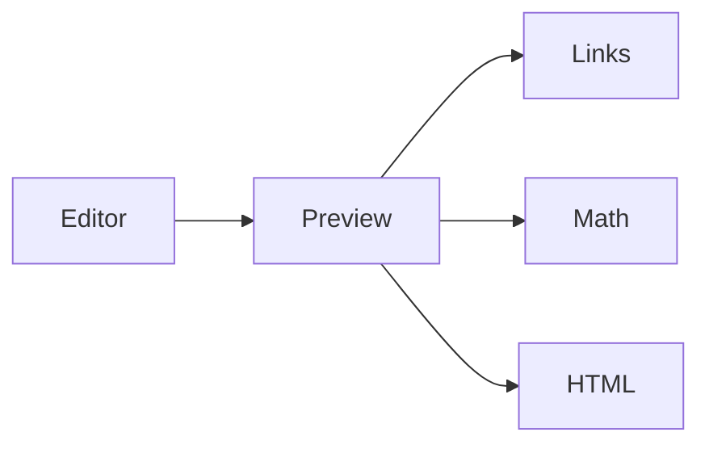

# Preview Kitchen Sink

This document is intentionally dense. Use it to smoke-test both Markdown Preview Enhanced and the styled VS Code fallback.

[Jump to math](#math) · [Jump to links](#links-and-sections) · [Jump to raw HTML](#raw-html)

## Text and GitHub-style formatting

Normal text with **bold**, *italic*, ***bold italic***, ~~strikethrough~~, `inline code`, and an escaped \*asterisk\*.

> [!NOTE]
> GitHub-style callout syntax should remain readable even when a renderer treats it as a normal blockquote.

- [x] checked item
- [ ] unchecked item
- nested list
  - child item
  - child with a [relative link](./test.md)

1. first
2. second
3. third

| Feature | Example |
| --- | --- |
| Inline code | `const answer = 42` |
| Emphasis | **strong** and *emphasized* |
| HTML | <kbd>Cmd</kbd> + <kbd>K</kbd> |

## Math

Inline math: $E = mc^2$ and $e^{i\pi} + 1 = 0$.

$$
\int_0^1 x^2\,dx = \frac{1}{3}
$$

$$
A = \begin{bmatrix}
1 & 2 \\
3 & 4
\end{bmatrix}
$$

## Code and diagrams

```typescript
type PreviewMode = 'enhanced' | 'builtin';

export function label(mode: PreviewMode): string {
  return `preview:${mode}`;
}
```

```json
{
  "theme": "github-dark",
  "live": true
}
```



## Links and sections

- [External link](https://example.com "Example title")
- [Relative Markdown link](./AaronSwartz.md)
- [Fragment link back to the top](#preview-kitchen-sink)
- <https://example.com/autolink>
- <mailto:preview@example.com>


### Repeated subsection

This heading checks nested section layout and generated anchors.

### Repeated subsection two

This section ensures nearby headings do not collapse together.

## Raw HTML

<section id="raw-html">

### HTML inside Markdown

<details>
<summary>Expandable details</summary>

Markdown inside an HTML details block should remain readable.

</details>

<div>
  <p>Raw HTML paragraph with <mark>highlighting</mark>, <kbd>keyboard keys</kbd>, and H<sub>2</sub>O.</p>
  <p><span style="text-decoration: underline;">Inline styled text</span> exercises HTML styling without external CSS.</p>
</div>

</section>

## Footnotes

The preview should preserve a normal same-file footnote reference.[^kitchen-sink]

[^kitchen-sink]: A regression footnote with **formatting**, a [link](https://example.com/footnote), and `code`.
