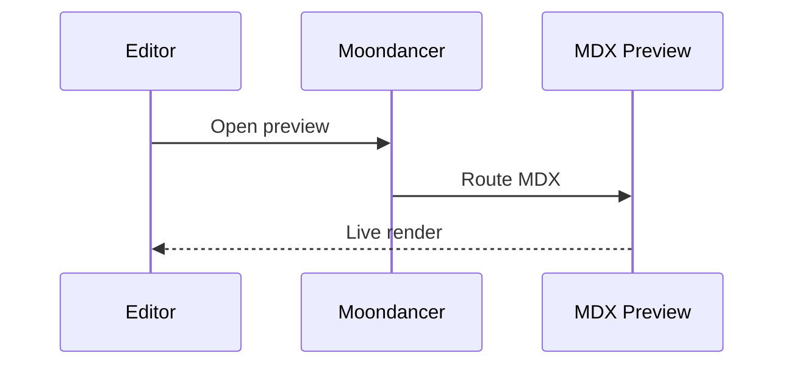

import { DemoCard } from './MdxCard'
import Transcluded from './Transcluded.mdx'

export const answer = 42

# MDX Preview Kitchen Sink

[Jump to components](#components) · [Jump to math](#math) · [Jump to JSX](#jsx-and-html)

## Markdown and GFM

Normal **bold**, *italic*, ~~strikethrough~~, and `inline code`.

- [x] checked task
- [ ] unchecked task

| Feature | Status |
| --- | --- |
| Tables | Works |
| JSX | Smart routing |
| Math | KaTeX |

> [!TIP]
> GitHub-style callouts should remain readable in the preview.

## Components

<DemoCard title="Imported component">
  Markdown children can contain **formatting**, [external links](https://example.com), and inline math $a^2 + b^2 = c^2$.
</DemoCard>

<Transcluded />

<div className="grid gap-4 rounded-lg border p-4">
  <strong>Tailwind-aware class names</strong>
  <span data-answer={answer}>Expression value: {answer}</span>
</div>

## Math

Inline math: $e^{i\pi} + 1 = 0$.

$$
\sum_{n=1}^{\infty} \frac{1}{n^2} = \frac{\pi^2}{6}
$$

## Links and sections

- [Relative MDX link](./Transcluded.mdx)
- [Relative Markdown link](./test.md)
- [Fragment link](#jsx-and-html)
- <https://example.com/autolink>

## Code and diagrams

```tsx
export function Example({ value }: { value: number }) {
  return <strong>{value}</strong>
}
```



## JSX and HTML

<section id="jsx-and-html">
  <details>
    <summary>Expandable MDX details</summary>
    <p>
      Raw JSX-like HTML with <mark>highlighting</mark>, <kbd>keyboard keys</kbd>,
      and a <a href="https://example.com/html-link">normal HTML link</a>.
    </p>
  </details>
</section>
